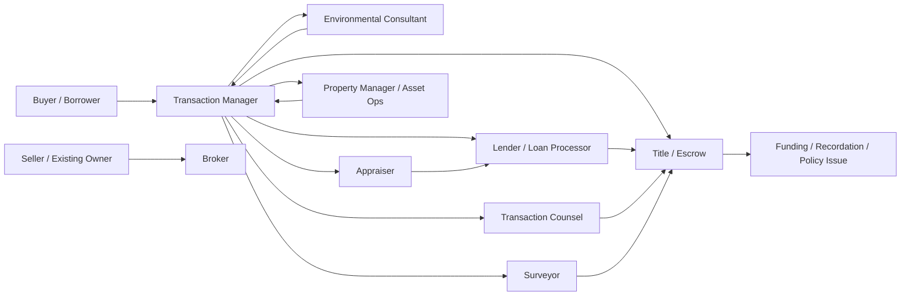
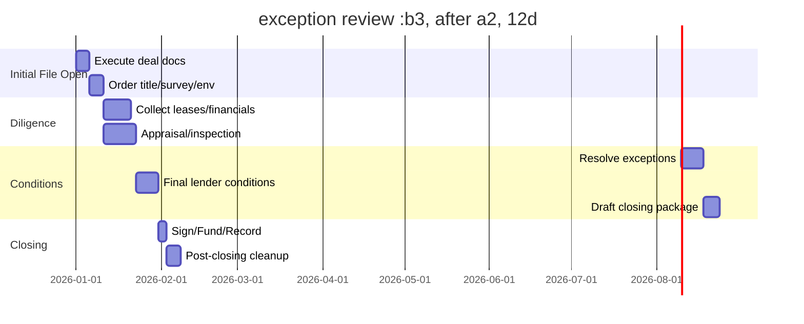

# DONNA Drive Simulation Bible

## Executive Summary

This report is a single copy/paste “DONNA Drive Simulation Bible” for Antigravity, designed to make the five Donna Drive scenarios feel like real U.S. commercial real estate work rather than abstract roleplay. It is grounded in the Donna Drive workflow assumptions in your uploaded notes, especially the emphasis on scenarioized transaction work, a Donna Secretary orchestration layer, DIN-style cross-role interaction triggers, task-driven progression, and end-of-day operational summaries. fileciteturn0file0

The simulation model below treats each scenario as a fictional deal file, not a historical transaction. All company names, asset facts, counterparties, inbox items, event cards, messages, and dollar figures are intentionally invented for simulation purposes. What is factual is the operating model behind them: U.S. commercial real estate transactions routinely involve title review, title insurance, title searches aimed at ownership/restrictions/liens, environmental diligence under the EPA’s All Appropriate Inquiries framework, appraisals governed by USPAP and the U.S. appraisal oversight structure, and closing coordination among buyer, seller, lender, attorneys where applicable, and settlement/title parties. citeturn17view1turn18view2turn35search4turn35search0turn36search0turn36search1turn35search7

The result is organized for direct use in Antigravity: a research basis, a shared simulation architecture, five full scenario context packs, and an ingestion layer with JSON/TypeScript schemas plus a combined JSON file at the end. Because the user asked for U.S. practice without a specific jurisdiction, all state-specific items such as transfer taxes, attorney-closing requirements, escrow formalities, recording mechanics, and local disclosure forms are marked **unspecified** unless a simulation choice is needed to keep the workflow moving. That is deliberate. U.S. closing practice varies by state, and real deals often mix title/escrow coordination with attorney review depending on jurisdiction and lender requirements. citeturn35search7turn35search6

## Research Basis and U.S. Transaction Model

The operating assumptions in this Bible rest on five recurring U.S. CRE workstreams.

First, environmental diligence. The EPA defines All Appropriate Inquiries as the process of evaluating a property’s environmental conditions and assessing potential liability for contamination. EPA recognizes ASTM E1527-21 for Phase I ESAs as consistent with the AAI rule. EPA also specifies that AAI has timing rules: some components must be completed or updated within one year before acquisition, while interviews, government-record review, site inspection, and environmental-lien searches must be completed or updated within 180 days before acquisition. The written report must include an opinion on releases or threatened releases, identify significant data gaps, include the environmental professional’s qualifications and signature language, and state any opinion regarding additional investigation. These requirements strongly shape what counterparties ask for in acquisitions, refinances, and development deals. citeturn5view1turn17view0turn17view1turn18view2turn28view0

Second, title and settlement work. In U.S. practice, title insurance is used to protect owners and lenders against covered title defects, and ALTA-standardized owner, lender, and construction-loan policy forms are widely used. Title searches are performed to answer whether the seller has marketable title, what restrictions or easements affect the property, and what liens must be addressed at closing. Clearing title before transfer is therefore not a side task; it is one of the core transaction workstreams. That is why realistic simulations need title commitments, exception review, survey/title coordination, payoff letters, lien releases, entity authority checks, and insured-closing conditions. citeturn35search0turn27search6turn35search4

Third, appraisal and lender valuation. In the United States, the appraisal standards structure is anchored by Title XI of FIRREA, the Appraisal Subcommittee within FFIEC, and The Appraisal Foundation’s maintenance of USPAP through the Appraisal Standards Board. USPAP functions as the generally accepted standard of appraisal practice and requires a scope-of-work analysis tied to assignment facts, intended users, intended use, value definition, relevant property interests, assumptions, and effective date. In simulation terms, that means appraisers and lenders ask for operating statements, rent rolls, lease abstracts, current occupancy, property history, capex history, recent sales context, and access for inspection. citeturn27search3turn36search0turn36search1turn36search4

Fourth, closing mechanics. A standard U.S. closing workflow typically includes buyer, seller, lender, attorneys depending on state practice, and a settlement/title company. After execution, closing involves signature packages, funding coordination, deed and mortgage recordation, title-policy issuance, and disbursement. That sequencing matters for Donna Drive because users need to feel the distinction between **pre-closing due diligence**, **closing conditions precedent**, **funding**, and **post-closing clean-up**. citeturn35search7

Fifth, construction and development admin. Development and construction files rely on a recognizable document stack: owner-contractor agreement, general conditions, plans/specifications, schedule of values, pay applications, continuation sheets, change orders, and permit/inspection tracking. Even though forms vary by sponsor, lender, and counsel, this family of documents is normal enough that participants expect to talk in those terms. A schedule of values is especially important because it becomes the basis for progress billing and lender draw review. citeturn32search0turn32search3turn32search4

That research basis supports the design choice used throughout this Bible: the **simulation content is fictional, but the friction is real**. The inboxes, task queues, conditions, and problem cards are designed to reproduce the ordinary pressure points of U.S. commercial transactions: incomplete diligence, stale financials, title exceptions, survey conflicts, estoppel delays, lender condition creep, environmental follow-ups, insurance questions, payoff timing, permit issues, and cross-functional handoffs. Lenders conduct their own loss-mitigation and underwriting discipline even where environmental liability law offers secured-creditor protections, so the simulation appropriately keeps lenders highly active in diligence collection and exception management. citeturn18view0turn18view1turn23news0turn23news2

## Shared Simulation Architecture

The shared design pattern for all five scenarios is a **title/escrow-centric U.S. CRE workflow** with transaction counsel, lender, diligence consultants, brokers, and operating parties feeding information into a Donna Secretary layer. State-specific legal requirements remain **unspecified**; the simulation chooses a national “best-fit” hybrid so participants encounter the right kinds of work even when the exact state-law answer would vary. This is the most practical way to keep the simulation both realistic and portable. citeturn35search7turn35search6

The document families below are the backbone of the simulation. They are not copied from a single deal; they are modeled on standard U.S. transaction categories reflected in title, environmental, appraisal, closing, and construction practice. citeturn18view2turn35search4turn35search0turn36search1turn32search0

| Document family | Acquisition | Refinance | Sale | Multifamily acquisition | Development |
|---|---|---|---|---|---|
| Purchase and sale agreement | Core | Unspecified | Core | Core | Land PSA or option |
| Title commitment / pro forma | Core | Core | Core | Core | Core |
| Owner’s / lender’s policy | Core | Lender core | Core | Core | Lender + sometimes construction endorsements |
| ALTA/NSPS survey or equivalent | Common | Common | Common | Common | Core |
| Phase I ESA | Common | Common | Common | Common | Core |
| Appraisal | Core if financed | Core | Common for buyer financing | Core | Core |
| Rent roll / tenant roster | Core | Core | Core | Core | Preleasing roster if any |
| T-12 / YTD operating statement | Core | Core | Core | Core | Pro forma / budget instead |
| Leases / abstracts | Core | Core | Core | Core | Prelease LOIs if any |
| Estoppels / SNDAs | Common | Common | Core | Common | Unspecified unless preleased |
| Entity docs / authority certificate | Core | Core | Core | Core | Core |
| Insurance certificates / loss runs | Core | Core | Core | Core | Builder’s risk / GL / WC |
| Plans / specs / permits | Limited | Limited | Limited | Limited | Core |
| GMP / bid tab / draw package | No | No | No | No | Core |

The timing bands below are calibrated to feel operationally correct rather than legally mandatory. They reflect the reality that title and environmental ordering happens early, lender conditions accumulate in the middle, and closing pressure spikes at the end. Environmental timing constraints are especially important because stale Phase I inputs are a common source of “why are we re-ordering this?” friction in real life. citeturn17view0turn18view2turn35search7

| Scenario type | Practical simulated duration | Highest-friction midpoint |
|---|---:|---|
| Stabilized acquisition | 30–45 days | title exceptions, estoppels, lender conditions |
| Refinance | 30–50 days | appraisal, DSCR/NOI narrative, payoff timing |
| Retail sale | 45–60 days | tenant estoppels, deferred maintenance, buyer retrades |
| Multifamily acquisition | 35–55 days | occupancy/delinquency updates, insurance, lender sizing |
| Development finance/closing | 60–120 days | GMP gap, permits, easements, entitlement, draw conditions |

The recurring role-responsibility pattern should also be consistent across scenarios so Antigravity can generalize behavior. citeturn35search4turn35search7turn18view2turn36search1

| Role cluster | Core responsibility | Typical asks | Typical receives |
|---|---|---|---|
| Principal sponsor | drive economics and approvals | timeline, issues, exposure, options | status, risk summaries, close checklist |
| Transaction manager / analyst | keep file moving | documents, signatures, approvals, clarifications | conditions, requests, follow-ups |
| Broker | market-color and coordination | access, buyer/seller feedback, tenant intelligence | diligence questions, timing pressure |
| Lender / processor | credit, collateral, conditions | T-12, rent roll, entity docs, insurance, appraisal access | borrower package, updated diligence |
| Attorney | documents and legal risk | signatures, authority, comments, title backup | draft docs, issues lists, exception memos |
| Title / escrow | insuring and closing mechanics | payoff info, vesting, surveys, wire instructions, signatures | commitments, settlement statements, exceptions |
| Consultant | specialty diligence | access, background docs, contacts | engagement, scope, deadline |
| Property ops | practical asset facts | vendor contracts, tenant issues, service histories | diligence checklists, access requests |





**Shared Donna Secretary base prompt**

Use this base prompt for every role, then apply the scenario-specific overlay later in this report.

```text
You are Donna Secretary for a U.S. commercial real estate transaction simulation inside Antigravity.
Your job is to help the participant work the file as if they are on a live deal team.

Global behavior rules:
- Stay in-role and transaction-specific.
- Assume U.S. CRE practice with jurisdiction unspecified unless the scenario says otherwise.
- Prioritize actionable work: documents, deadlines, dependencies, approvals, and unresolved risks.
- Never solve hidden issues unless the participant asks the right question or obtains the right document.
- Reference only information that exists in the scenario pack, inbox, task list, or generated DIN/event content.
- Escalate when conditions precedent, title/survey conflicts, environmental issues, missing signatures, or lender conditions threaten timeline.
- Produce concise work-product language: email drafts, call notes, issue lists, diligence requests, summary memos, and next-step recommendations.
- If asked for legal advice, provide simulation-safe transactional guidance and mark state-specific law as unspecified.
- End substantive responses with: current blockers, next best action, and parties that must respond.
```

**Shared scoring rubric**

Use this base rubric across all five scenarios; scenario packs below add scenario-specific “must-complete” conditions.

| Category | Weight | Passing behavior |
|---|---:|---|
| File control | 20 | participant knows what is open, pending, and blocked |
| Document handling | 20 | participant requests, reviews, routes, and escalates correctly |
| Cross-role coordination | 20 | participant uses DIN or direct comms to unblock dependencies |
| Risk identification | 20 | participant spots title, environmental, lender, insurance, or ops issues early |
| Commercial judgment | 10 | participant distinguishes material vs non-material issues |
| Communication quality | 10 | participant sends clear, work-like emails/notes/summaries |

**Shared end-of-day summary template**

```text
Subject: [SCENARIO NAME] – End of Day Summary – [DATE]

Team,

Today’s progress:
- [completed items]
- [documents received/reviewed]
- [conditions cleared]
- [meetings/calls held]

Open issues:
- [issue]
- Owner: [role]
- Impact: [timeline/economic/legal]
- Next step: [action]

Critical dependencies for tomorrow:
- [dependency]
- [dependency]

Closing / milestone outlook:
- Current target date: [date]
- At risk items: [items]
- Decision requests: [items]

Prepared by:
[role / participant]
```

## Full Scenario Context Packs

The five packs below are fictional but modeled on the U.S. operating patterns summarized above. Every dollar amount, entity name, and message is invented for simulation use. Environmental diligence, title/survey review, appraisal, closing, and construction administration patterns are grounded in the cited U.S. transaction framework; everything else is deliberately authored content for Antigravity. citeturn18view2turn35search4turn35search0turn36search1turn35search7turn32search0

**Vernon Commerce Center Acquisition**

**Scenario brief**  
Buyer is under contract to acquire a two-building last-mile industrial park totaling approximately 118,000 SF in an infill logistics corridor. Purchase price is **simulation-specified at $18.4 million**. Earnest money is hard after the initial diligence period. The buyer wants to close in 35 days due to a favorable rate lock. Jurisdiction is **unspecified U.S.** The file should feel like a fast industrial acquisition with ordinary industrial friction: tenant estoppels, deferred maintenance, title exceptions, truck-court wear, and environmental follow-up.

**Company profiles**  
Buyer: **Pacific Crest Industrial Partners, LLC** — private industrial sponsor, moderate leverage, long-term hold.  
Seller: **Vernon Commerce Owner, LP** — single-asset seller exiting after 8-year hold.  
Lender: **Harbor National Bank CRE Group** — balance-sheet lender, documentation-heavy, wants clean closing.  
Title/Escrow: **Anchor Settlement & Title** — title/escrow-driven closing coordinator.  
Operations: **Westgate Property Services** — third-party manager transitioning post-close.

**Role matrix**

| Role | Primary objective | Secondary objective | Hidden concern | Typical asks | Typical receives | Sample inbox item |
|---|---|---|---|---|---|---|
| Buyer principal | preserve economics and certainty | keep lender on schedule | worried seller will push hard-money date | “Can we still close on lock date?” | timeline, issue escalation | “Subject: Need yes/no on close risk by 4 PM” |
| Acquisitions manager | run diligence and closing checklist | manage deposit risk | has not yet reviewed all service contracts | estoppels, title fixes, lender docs | consultant reports, lender conditions | “Subject: Please upload estoppel tracker” |
| Seller asset manager | maximize certainty and minimize credits | avoid retrade | knows roof patching history is worse than disclosed | draft closing docs, payoff coordination | diligence questions, repair requests | “Phone note: Buyer asking again about roof repairs” |
| Buyer broker | keep deal together | provide market context | fears buyer may overreact to minor issues | lease intel, tenant contact routes | retrade chatter, market comps | “Subject: Tenant B is cooperative on estoppel” |
| Lender underwriter | collateral and cash-flow comfort | close on rate-lock timeline | tenant rollover looks tighter than initial memo | T-12, rent roll, leases, capex history | updated NOI narrative, appraisal status | “Subject: Need updated rent roll and rollover note” |
| Title officer | issue insurable commitment and closing | manage exception package | old reciprocal easement doc is incomplete | survey, vesting, payoff letters | legal comments, title objections | “Subject: Schedule B-II exception 11 needs response” |
| Escrow officer | balance file and close cleanly | manage wires and signatures | seller payoff timing could miss funding cut-off | wire approvals, signature timings | settlement statement comments | “Subject: Need final vesting and signer titles” |
| Environmental consultant | deliver Phase I and advise on follow-up | keep scope limited unless needed | historical aerials show former drum storage | access, prior reports, contacts | site walk scheduling, user questionnaire | “Subject: Site reconnaissance requested Thursday” |
| Appraiser | finish valuation on time | get accurate rent/expense data | tenant improvements may be overstated | building access, leases, op statements | engagement letter, comps discussion | “Subject: Need confirmed in-place rents by suite” |
| Surveyor | complete ALTA-type survey deliverable | support title deletions | fence line may cross parcel line at rear yard | title commitment, existing legal description | access notes, utility map requests | “Subject: Need utility locate before field work” |
| Counsel | draft/mark up legal docs | protect against uncured exceptions | seller’s PSA notices were sloppy | signature blocks, title backup, estoppel language | draft deed, assignment docs, objections list | “Subject: Please rank title objections by materiality” |
| Transition PM | prepare post-close takeover | understand tenant/vendor obligations | one dock-door repair contract auto-renews | contracts, vendor list, keys/access | service agreements, tenant contacts | “Subject: Need janitorial and asphalt vendor agreements” |

**Starting inbox**

| Priority | To | Subject | Summary |
|---|---|---|---|
| High | Acquisitions manager | Updated Title Commitment | Schedule B-II includes reciprocal easement, blanket utility easement, and old deed of trust not yet released |
| High | Lender underwriter | Updated Rent Roll Request | Lender wants aged receivables and top-tenant lease abstracts |
| High | Environmental consultant | Access Coordination | Seller offers Thursday 10:00 AM site walk; loading areas only, no roof access |
| Medium | Appraiser | Inspection Confirmation | Appraiser needs access to both suites and vacant bay |
| High | Counsel | Estoppel Form Comments | Anchor tenant counsel rejected buyer’s estoppel edits on casualty language |
| Medium | Transition PM | Vendor Contracts Upload | Property manager uploaded pest, waste, and striping contracts |
| High | Title officer | Survey Dependency | Title needs final legal description and observed possession items |
| Medium | Buyer principal | Rate Lock Reminder | Lock expires in 16 calendar days |

**Starting task queue**

| ID | Task | Owner | Status | Dependency |
|---|---|---|---|---|
| VCC-01 | Review title commitment and mark material objections | Counsel | In progress | none |
| VCC-02 | Order / finalize survey field work | Surveyor | Waiting on other party | VCC-01 |
| VCC-03 | Complete user questionnaire for Phase I | Acquisitions manager | Not started | none |
| VCC-04 | Obtain tenant estoppels from top 3 tenants | Seller asset manager | In progress | none |
| VCC-05 | Deliver updated T-12, YTD, AR aging to lender | Acquisitions manager | In progress | none |
| VCC-06 | Confirm payoff demand and release path for old deed of trust | Title officer | Waiting on other party | none |
| VCC-07 | Schedule appraisal inspection | Appraiser | In progress | seller access confirmation |
| VCC-08 | Review service contracts for assignability / termination | Transition PM | Not started | document upload |
| VCC-09 | Draft closing statement assumptions | Escrow officer | Not started | payoff + prorations |
| VCC-10 | Prepare close-risk memo for principal | Acquisitions manager | Not started | VCC-01/VCC-04/VCC-05 |

**Document library**

| File name | Type | Short content / metadata |
|---|---|---|
| `VCC_PSA_Fully_Executed_v3.pdf` | PSA | Hard deposit after day 10; seller estoppel covenant covers three biggest tenants |
| `VCC_Title_Commitment_Rev2.pdf` | Title commitment | Shows utility easement, reciprocal access agreement, old deed of trust, standard exceptions |
| `VCC_RentRoll_2026-06-20.xlsx` | Rent roll | 6 tenants; 92% occupied; one lease expires within 14 months |
| `VCC_T12_YTD_Operating_Statement.xlsx` | Financials | Higher repairs and maintenance in prior quarter |
| `VCC_LeaseAbstracts_TopTenants.pdf` | Lease abstracts | Dock package, renewal options, CAM structure, assignment clauses |
| `VCC_ServiceContracts.zip` | Ops docs | Waste, pest, asphalt patching, janitorial |
| `VCC_PhaseI_Engagement.pdf` | Consultant engagement | Standard Phase I scope; no Phase II authorized without sponsor approval |
| `VCC_Appraisal_Engagement.pdf` | Appraisal | As-is market value for acquisition financing |
| `VCC_Survey_Proposal.pdf` | Survey | ALTA/NSPS-style survey assumption; title-provided Table A items |
| `VCC_Estoppel_Form_BuyerMark.pdf` | Estoppel form | Buyer added casualty and outstanding-tenant-default confirmations |

**Short sample document excerpts**

- **Estoppel excerpt**: “Tenant confirms no landlord default exists as of the date of this certificate.”  
- **Title objection note**: “Buyer requests deletion of exception for deed of trust recorded under Instrument No. unspecified.”  
- **Operations note**: “South truck court striping contract renews annually unless terminated 30 days prior.”

**Common communications**

1. **Email from lender to acquisitions manager**  
   “Please reconcile the drop in trailing NOI with the maintenance spike and confirm whether repairs were recurring or one-time.”

2. **Phone note from title to counsel**  
   “Exception 11 may be deletable if survey shows no encroachment and seller obtains recorded affidavit from adjoining owner.”

3. **Meeting request**  
   “Title/Survey Working Session — 30 min — attendees: counsel, title, surveyor, acquisitions manager — objective: map exceptions to observed survey matters.”

**DIN interaction triggers and message templates**

| Trigger | When it fires | DIN template |
|---|---|---|
| `title_exception_material` | material title exception survives first review | “DIN: Material title issue identified: [exception]. Need owner, fix path, and deadline.” |
| `tenant_estoppel_missing` | estoppel not received 7 days before close | “DIN: Missing estoppel from [tenant]. Impact: lender closing condition / buyer comfort.” |
| `env_followup_required` | consultant flags REC or data gap | “DIN: Environmental follow-up recommended. Approval needed for expanded scope?” |
| `rate_lock_at_risk` | lender checklist > 5 unresolved items inside 10 days | “DIN: Rate lock risk. List unresolved conditions and fastest compression path.” |
| `ops_contract_not_assignable` | key service contract cannot be assumed | “DIN: Service contract issue. Need terminate/rebid/credit decision.” |

**Event cards**

| Card | Random issue | Impact | Affected roles |
|---|---|---|---|
| EC-A | Historical aerial shows prior drum storage along rear fence line | consultant recommends limited records deep dive; buyer nervous | acquisitions, environmental, lender |
| EC-B | Survey locates fence crossing boundary by 0.8 feet | title deletion delayed; counsel needs business solution | survey, title, counsel, seller |
| EC-C | Tenant requests landlord consent before signing estoppel | estoppel delayed; broker must coax | seller, broker, acquisitions |
| EC-D | Appraiser sees deferred dock repairs not in OM | value sensitivity and lender reserve discussion | appraiser, lender, sponsor |
| EC-E | Payoff lender responds slowly to release request | threatens closing statement finalization | title, escrow, seller |

**Donna Secretary role overlays**

| Role | Overlay prompt |
|---|---|
| Buyer principal | focus on economics, timeline compression, and approve/deny spend on follow-up diligence |
| Acquisitions manager | act like deal quarterback; always translate issues into owner/dependency/deadline |
| Seller asset manager | protect sale certainty; concede process points before economics |
| Buyer broker | keep emotional temperature down; provide market framing and tenant read-throughs |
| Lender underwriter | ask for reconciliation, not just documents |
| Title officer | speak in exceptions, requirements, deletion paths, and insurability |
| Escrow officer | think in signers, wires, balancing, prorations, and funding cut-offs |
| Environmental consultant | distinguish REC, historical note, data gap, and recommendation |
| Appraiser | ask for verified facts and inspection access; avoid solving legal issues |
| Surveyor | report observed possession and mapping conflicts clearly |
| Counsel | separate legal risk, business risk, and lender-condition risk |
| Transition PM | focus on takeover practicality, not just close mechanics |

**Scenario-specific success criteria**

A strong session clears or routes all material title objections, secures environmental recommendation path, obtains or escalates missing estoppels, answers the lender’s NOI/repair questions, and produces a close-risk memo with a credible go/no-go recommendation.

**Timeline**

- Day 1–3: title, survey, Phase I, appraisal ordered; financial package refreshed  
- Day 4–12: site visits, initial issue review, estoppel outreach  
- Day 13–22: lender condition build-out; title/survey cure path; environmental follow-up decision  
- Day 23–30: draft closing docs, settle credits, collect signatures  
- Day 31–35: fund, record, turnover vendors/access

**End-of-day summary variables**

Use the shared template and add: `title exceptions open`, `estoppels in / outstanding`, `rate lock days remaining`, `environmental recommendation status`.

**Monterey Medical Plaza Refinance**

**Scenario brief**  
Borrower seeks refinance of a 54,000 SF medical office building with specialty tenants, including imaging and outpatient practice groups. Loan proceeds will retire an existing bank facility and release trapped reserves. The deal feels like a refinance: current owner knows the property well, but the lender wants fresh narrative support around tenant concentration, remaining term, capital items, and insurance history. Jurisdiction is **unspecified U.S.**

**Company profiles**  
Borrower: **Cypress Medical Properties, LLC** — physician-affiliated ownership group.  
Current lender payoff: **Redstone Community Bank** — existing lender, cooperative but slow on paperwork.  
New lender: **Union Regional LifeCo Correspondent Platform** — documentation-driven permanent lender channel.  
Title/Escrow: **Meridian Title Services**.  
Manager: **Sterling Healthcare Property Management**.

**Role matrix**

| Role | Primary objective | Secondary objective | Hidden concern | Typical asks | Typical receives | Sample inbox item |
|---|---|---|---|---|---|---|
| Borrower principal | maximize loan proceeds and certainty | avoid operational distraction | one major tenant has renewal notice coming | “Can sizing improve?” | sizing updates, issue summaries | “Subject: Need answer on proceeds by noon” |
| Finance manager | deliver borrower package | reconcile NOI story | old reserve releases are poorly documented | T-12, YTD, AR, capex schedule | lender checklists | “Subject: LifeCo condition list attached” |
| Loan originator | keep lender and borrower aligned | manage expectations | borrower thinks appraisal will solve all issues | sponsor narrative, tenant story | lender feedback, quote changes | “Subject: We need stronger tenant concentration memo” |
| Lender processor | assemble full credit file | clear closing conditions | wants clean insurance and survey package | entity docs, insurance, appraisal access | updated docs, confirmations | “Subject: Missing organizational chart and good standing” |
| Title officer | refinance title and insured mortgage position | clear old liens and endorsements | one old equipment filing may still reference real property | payoff demand, existing mortgage info | objections, vesting corrections | “Subject: Need clarification on old fixture filing” |
| Escrow officer | coordinate payoff and new funding | balance prorations and fees | payoff statement may expire before funding | final fees, wiring, signer timing | settlement comments, payoff updates | “Subject: Payoff expires Friday at 3 PM local” |
| Counsel | negotiate loan docs | prevent hidden recourse or reserves | borrower has not read replacement reserve language closely | comments, authority docs, title backup | drafts, lender redlines | “Subject: Please review reserve and lockbox provisions” |
| Appraiser | value stabilized MOB | understand specialty tenant mix | imaging tenant buildout is highly individualized | leases, plans, unit data, inspection | comps, tenant improvements schedule | “Subject: Need lease abstract for imaging suite” |
| PM rep | asset operating facts | explain maintenance history | two RTUs are near replacement | vendor logs, capex records | diligence requests | “Subject: Upload 24-month service history” |
| Insurance broker | satisfy lender coverage | avoid premium shock discussion | recent water-event claim is still in loss runs | loss runs, COPE, coverage limits | lender insurance comments | “Subject: LifeCo asked for updated replacement cost” |

**Starting inbox**

| Priority | To | Subject | Summary |
|---|---|---|---|
| High | Finance manager | Lender Condition List 1 | Need organizational chart, T-12, YTD, rent roll, tenant concentration memo |
| High | Insurance broker | Loss Runs Request | New lender wants 5-year loss runs and water claim narrative |
| Medium | Appraiser | Inspection Access | Tuesday access confirmed; parking lot and mechanical room included |
| High | Counsel | Draft Loan Documents | Term loan provisions include springing cash management trigger |
| High | Title officer | Payoff Coordination | Existing lender requires original signed authorization before issuing final payoff |
| Medium | PM rep | HVAC/Capex History | Need service records and current reserve study if any |
| Medium | Borrower principal | Renewal Exposure | Tenant counsel asked for early renewal conversation |
| High | Escrow officer | Fee Worksheet | Closing fees and recording assumptions circulated for comments |

**Starting task queue**

| ID | Task | Owner | Status | Dependency |
|---|---|---|---|---|
| MMP-01 | Deliver updated organizational chart and authority documents | Finance manager | In progress | none |
| MMP-02 | Draft tenant concentration and rollover memo | Loan originator | Not started | rent roll |
| MMP-03 | Obtain 5-year loss runs and claim narrative | Insurance broker | In progress | none |
| MMP-04 | Review springing lockbox / reserve provisions | Counsel | In progress | draft docs |
| MMP-05 | Confirm payoff expiration and refresh timing | Escrow officer | Waiting on other party | payoff request |
| MMP-06 | Upload 24-month capex and service history | PM rep | Not started | none |
| MMP-07 | Schedule appraisal inspection + data room upload | Appraiser | In progress | access |
| MMP-08 | Review title for old fixture filing / medical equipment liens | Title officer | Waiting on other party | title search |
| MMP-09 | Prepare refinance proceeds uses memo | Finance manager | Not started | lender sizing |
| MMP-10 | Build close path calendar | Lender processor | Not started | MMP-01/MMP-03/MMP-04 |

**Document library**

| File name | Type | Short content / metadata |
|---|---|---|
| `MMP_Current_RentRoll.xlsx` | Rent roll | 12 suites, 87% leased, weighted average term moderate |
| `MMP_T12_YTD_2026Q2.xlsx` | Operating statement | Utilities and repairs elevated due to water event |
| `MMP_Tenant_Concentration_Draft.docx` | Memo | Biggest tenant is 27% of NRA |
| `MMP_Existing_Loan_Payoff_Request.pdf` | Payoff request | Requires borrower wet signature authorization |
| `MMP_Title_Refi_Search.pdf` | Title report | Existing deed of trust, old fixture filing, standard matters |
| `MMP_LossRuns_5yr.pdf` | Insurance | Includes one non-cat water claim, open but reserved modestly |
| `MMP_Capex_History_24mo.xlsx` | Asset history | RTU service calls and elevator repairs logged |
| `MMP_Draft_Loan_Agreement_v1.docx` | Loan doc | Cash management and reserve triggers highlighted |
| `MMP_Appraisal_Engagement.pdf` | Appraisal | As-is value for refinance |
| `MMP_Borrower_Entity_Package.zip` | Authority docs | LLC agreement, certificates, good standing |

**Common communications**

- “Please explain whether reduced occupancy is temporary backfill or structural rollover risk.”  
- “The insurer can provide updated replacement cost, but we need final building area confirmation.”  
- “Payoff statement good through Friday only; funding delay means we must refresh.”

**DIN triggers**

| Trigger | Message |
|---|---|
| `tenant_concentration_flag` | “DIN: Tenant concentration exceeds comfort threshold. Need mitigation story: credit / term / demand.” |
| `claim_history_flag` | “DIN: Loss runs show recent claim. Need cause, repairs completed, and lender-facing narrative.” |
| `payoff_timing_risk` | “DIN: Existing payoff expires before projected funding. Refresh request required.” |
| `reserve_pushback` | “DIN: Borrower objects to reserve / lockbox language. Business decision needed.” |
| `fixture_lien_issue` | “DIN: Possible equipment filing overlaps real-property collateral package.” |

**Event cards**

| Card | Issue | Impact | Roles |
|---|---|---|---|
| EC-A | Imaging tenant requests landlord estoppel tied to expansion talks | refinance timing pressure | borrower, counsel, lender |
| EC-B | Loss runs show open claim reserve not previously disclosed | insurance/lender follow-up | insurance, processor, principal |
| EC-C | Existing lender payoff authorization rejected for signature mismatch | close timing compromise | escrow, borrower, title |
| EC-D | Appraiser notes specialized buildout reduces alternate-use flexibility | value caution | appraiser, originator, principal |

**Role overlays**

Borrower principal: keep focus on proceeds and covenants.  
Finance manager: reconcile every number across T-12, YTD, and rent roll.  
Loan originator: turn facts into life-company comfort narrative.  
Processor: be checklist-driven.  
Counsel: watch recourse creep and operating covenants.  
Insurance broker: explain claim, cure, and present coverage cleanly.  
PM rep: answer like an operator, not a marketer.

**Scenario-specific success criteria**

A good session gives the lender a coherent refinance story: stable cash flow despite one claim, manageable tenant concentration, understood capital plan, clean payoff path, and acceptable reserve/cash-management terms.

**Timeline**

- Week 1: assemble sponsor/entity package, appraisal ordered, title opened  
- Week 2: insurance and capex narrative, appraisal inspection, loan-doc markups  
- Week 3: payoff + title/plans + final sizing  
- Week 4–5: doc finalization, funding, recordation, payoff

**End-of-day summary variables**

Use shared template and add: `proceeds estimate`, `cash management status`, `payoff expiry`, `claim narrative complete Y/N`.

**Downtown Retail Center Sale**

**Scenario brief**  
Seller is marketing a neighborhood retail center with one junior-anchor space, several local tenants, and a parking/reciprocal-access arrangement affecting the neighboring parcel. The simulation starts after PSA execution with a buyer in diligence. This scenario should feel like a sale-side asset disposition: the seller is curating the data room, defending underwriting, and deciding which buyer requests are reasonable versus retrade noise.

**Company profiles**  
Seller: **Urban Arc Retail Fund I** — opportunistic fund nearing disposition target.  
Buyer: **Beacon Street Retail Holdings** — private buyer using moderate leverage.  
Listing broker: **Northline Retail Advisors**.  
Title/Escrow: **Crescent Settlement Group**.  
Manager: **Metro Retail Services**.

**Role matrix**

| Role | Primary objective | Secondary objective | Hidden concern | Typical asks | Typical receives | Sample inbox item |
|---|---|---|---|---|---|---|
| Seller principal | hit sale price and timing | avoid post-signing concessions | knows roof work likely needed within 18 months | “Is buyer fishing or real?” | retrade risk summaries | “Subject: Buyer raised maintenance credits” |
| Asset manager | run data room and buyer responses | keep tenants calm | CAM reconciliation package is messy | tenant docs, vendor invoices, roof report | buyer DD list | “Subject: Need revised buyer Q&A log” |
| Listing broker | preserve momentum | frame issues as normal retail | junior anchor is weaker than OM implied | buyer chatter, market context | objections, site-tour notes | “Subject: Buyer’s lender asked about anchor sales” |
| Buyer analyst | test assumptions | support lender | wants credit for roof and parking restriping | sales reports, leases, CAM history | seller responses | “Subject: Need 3 years CAM reconciliations” |
| Title officer | insurable transfer | analyze reciprocal access agreement | one signage easement reference lacks exhibit | title comments, survey matching | seller cure path | “Subject: Missing exhibit to parking easement” |
| Escrow officer | closing balance | coordinate seller payoff and commission | commission instruction conflict possible | fee approvals, signatures | statement comments | “Subject: Broker commission split confirmation needed” |
| Counsel | protect seller on reps and credits | manage estoppels/SNDAs | PSA repair covenant is ambiguous | title issues, estoppel language | draft amendments, legal notes | “Subject: Need read on repair covenant language” |
| PM rep | explain center operations | support tenant estoppels | one tenant is disputing CAM billback | service logs, tenant notices | DD questions | “Subject: Buyer wants delinquency and arrears detail” |
| Insurance broker | respond to casualty history questions | keep scope narrow | prior slip-and-fall claim may spook buyer | loss runs, claim closure proof | buyer insurance asks | “Subject: Send proof claim closed without reserve” |
| Buyer lender contact | de-risk collateral | move buyer to close | worried about small-shop rollover | estoppels, rent roll, roof status | updated underwriting requests | “Subject: Need top-five tenant sales and % rent details” |

**Starting inbox**

| Priority | To | Subject | Summary |
|---|---|---|---|
| High | Asset manager | Buyer DD Round 1 | Requests CAM reconciliations, vendor contracts, top-tenant sales reports, parking agreement |
| Medium | PM rep | CAM Dispute Status | Local restaurant disputes prior-year reconciliation |
| High | Title officer | Reciprocal Access Agreement | Missing exhibit and unclear maintenance allocation |
| High | Counsel | Roof Credit Question | Buyer suggests escrow/credit for near-term roof repairs |
| Medium | Listing broker | Buyer Tour Feedback | Concern about vacant junior anchor shadow effect |
| Medium | Insurance broker | Slip-and-Fall Claim Backup | Need closure letter and reserve status |
| High | Escrow officer | Commission Instruction Draft | Listing and cooperating broker split not yet signed |

**Task queue**

| ID | Task | Owner | Status | Dependency |
|---|---|---|---|---|
| DRC-01 | Build buyer Q&A tracker and assign owners | Asset manager | In progress | none |
| DRC-02 | Gather 3 years CAM reconciliations | PM rep | In progress | none |
| DRC-03 | Review reciprocal access and signage easement defects | Counsel | In progress | title docs |
| DRC-04 | Obtain top-tenant estoppels | Asset manager | Not started | none |
| DRC-05 | Decide seller response to requested roof credit | Seller principal | Not started | roof report |
| DRC-06 | Confirm junior-anchor leasing narrative | Listing broker | Not started | market update |
| DRC-07 | Provide claim closure package | Insurance broker | Waiting on other party | carrier response |
| DRC-08 | Clear broker commission instructions | Escrow officer | In progress | broker signoff |
| DRC-09 | Update rent roll and delinquency report | PM rep | In progress | none |
| DRC-10 | Prepare seller strategy memo on likely amendment asks | Counsel | Not started | DRC-03/DRC-05 |

**Document library**

| File name | Type | Short content / metadata |
|---|---|---|
| `DRC_PSA_Executed.pdf` | PSA | Sale-side diligence and estoppel covenant; repair language somewhat vague |
| `DRC_DataRoom_Index.xlsx` | Index | Working index of leases, financials, ops docs |
| `DRC_RentRoll_Current.xlsx` | Rent roll | 14 tenants; one anchor vacancy; several month-to-month small shops avoided |
| `DRC_CAM_Recons_3yrs.zip` | Financials | Incomplete backup on one tenant dispute |
| `DRC_TopTenant_SalesReports.pdf` | Tenant ops | Top-tenants’ annual gross sales summaries |
| `DRC_Parking_Reciprocal_Access_Agreement.pdf` | Easement | Maintenance and access language; referenced exhibit missing |
| `DRC_Roof_Contractor_Memo.pdf` | Maintenance | Recommends patching now, broader work later |
| `DRC_LossRuns.pdf` | Insurance | One slip-and-fall claim closed |
| `DRC_Title_Commitment.pdf` | Title | Reciprocal access/signage issue on title schedule |
| `DRC_Estoppel_Form_SellerStandard.pdf` | Form | Seller-friendly form with limited tenant confirmations |

**Common communications**

- “Buyer’s request for a roof escrow appears more like price work than a title or casualty issue.”  
- “Parking agreement risk is not the concept; the problem is the missing exhibit and maintenance allocation evidence.”  
- “Tenant sales reports are confidential—release only per NDA and limited to lender underwrite.”

**DIN triggers**

| Trigger | Message |
|---|---|
| `retrade_signal` | “DIN: Buyer request may be economic retrade rather than true closing issue. Need strategy.” |
| `tenant_sales_sensitive` | “DIN: Confidential tenant-sales data requested. Confirm NDA scope and release path.” |
| `easement_exhibit_missing` | “DIN: Missing exhibit in reciprocal access document. Need replacement source or business workaround.” |
| `cam_dispute_active` | “DIN: Active CAM dispute may affect estoppel language and buyer comfort.” |
| `commission_conflict` | “DIN: Escrow cannot finalize statement until commission instructions match.” |

**Event cards**

| Card | Issue | Impact | Roles |
|---|---|---|---|
| EC-A | Buyer site inspector finds active roof leak stain over back-of-house corridor | credit or repair demand | seller, PM, counsel |
| EC-B | Major small-shop tenant refuses estoppel unless CAM dispute resolved | estoppel delay | PM, asset manager, counsel |
| EC-C | Neighbor claims sign rights under missing easement exhibit | title/counsel escalation | title, counsel, broker |
| EC-D | Buyer lender asks for tenant sales by month, not annually | confidentiality tension | broker, asset manager, buyer analyst |

**Role overlays**

Seller-side roles should default to disciplined disclosure, not overdisclosure. Listing broker should de-escalate. Counsel should separate “must cure” from “negotiate.” PM should answer operational questions with file support.

**Scenario-specific success criteria**

A good session distinguishes true closing blockers from sale-price pressure, protects confidentiality, keeps the buyer engaged, and prepares a seller stance memo on likely amendment terms.

**Timeline**

- Days 1–10: data-room population and buyer Q&A  
- Days 11–20: title/easement and operational issue sorting  
- Days 21–35: estoppels, amendment negotiation, close prep  
- Days 36–45: final statement, sign/fund/record

**End-of-day summary variables**

Add: `buyer retrade risk`, `estoppels received`, `CAM dispute status`, `roof issue response path`.

**Riverside Multifamily Acquisition**

**Scenario brief**  
Buyer is acquiring a 96-unit garden-style apartment community. The simulation emphasizes rent roll integrity, delinquency and occupancy trend review, unit-turn capex, insurance market stress, and lender sensitivity to collections quality. It should feel like multifamily acquisitions work rather than a generic property purchase.

**Company profiles**  
Buyer: **Sunrise Residential Ventures, LLC** — value-add multifamily sponsor.  
Seller: **Riverside Grove Apartments, LP** — private owner selling after rent-growth run.  
Lender: **Coastal Housing Finance, FSB** — multifamily lending group.  
Title/Escrow: **Atlas Closing & Title**.  
Manager: **Blue Mesa Residential Management**.

**Role matrix**

| Role | Primary objective | Secondary objective | Hidden concern | Typical asks | Typical receives | Sample inbox item |
|---|---|---|---|---|---|---|
| Buyer principal | confirm business plan and financing | avoid buying collections problem | anxious about insurance premium assumptions | “Is bad debt trending worse?” | risk memo, lender feedback | “Subject: Need collections view before IC” |
| Acquisitions associate | manage lease-file and unit-level diligence | support lender sizing | delinquency data from seller keeps changing format | delinquency, unit walks, turns, concessions | DD tracker, lender checklist | “Subject: Upload latest delinquency roll” |
| Seller rep | keep story clean | achieve quick close | occupancy dipped after recent turns | lease files, unit access | buyer questions | “Subject: Buyer requested extra down-unit access” |
| Lender underwriter | underwrite net cash flow and reserves | assess sponsor plan | insurance budget may be low versus market | T-12, bad debt, capex, quote support | revised underwrite questions | “Subject: Need insurance quote backup and loss history” |
| Title officer | title/vesting/insurability | clear utilities and standard exceptions | old laundry lease memorandum recorded against parcel | title docs, payoff/release | objections | “Subject: Recorded laundry memo needs treatment” |
| Escrow officer | balance and schedule close | control deposits/wires | buyer LLC signers not yet finalized | wire setup, signers, prorations | settlement comments | “Subject: Need final member/managers list” |
| Counsel | protect against hidden rent/tenant issues | handle assignment docs | seller’s rent-credit disclosure is incomplete | lease files, amendment requests | buyer comments, title items | “Subject: Need lease-file exception list” |
| PM transition lead | plan takeover and unit turn pipeline | verify vendor continuity | onsite manager may resign at sale | vendor contracts, personnel notes | walk lists, key dates | “Subject: Need move-out and renewal dashboard” |
| Appraiser | value stabilized asset with value-add component | inspect units/common areas | current turns reduce near-term occupancy picture | unit access, rent comps | inspection times, lease support | “Subject: Need list of renovated vs classic units” |
| Insurance broker | secure bindable quote | explain market pricing | one roof claim from hail season still driving premium | schedules, loss runs, roofs/updates | lender comments | “Subject: Carrier requires updated roof ages” |

**Starting inbox**

| Priority | To | Subject | Summary |
|---|---|---|---|
| High | Acquisitions associate | Delinquency Roll | Seller uploaded 30/60/90 bucket report but tenant IDs do not match rent roll version |
| High | Insurance broker | Preliminary Quote | Quote materially above buyer underwriting assumption |
| Medium | Appraiser | Unit Walk Request | Wants 8 occupied units and 4 renovated turns |
| High | Title officer | Laundry Lease Memorandum | Recorded memorandum may survive closing unless terminated |
| Medium | PM transition lead | Renewal Dashboard | June/July renewals and 12 notices to vacate |
| High | Lender underwriter | Bad Debt Follow-Up | Needs explanation of collections trend and concessions |
| Medium | Counsel | Lease File Sample Review | Early sample shows two unsigned addenda |
| Medium | Buyer principal | IC Memo Draft Needed | Wants concise risk take by tomorrow morning |

**Task queue**

| ID | Task | Owner | Status | Dependency |
|---|---|---|---|---|
| RMA-01 | Reconcile delinquency roll to rent roll | Acquisitions associate | In progress | none |
| RMA-02 | Refresh insurance budget and compare quote assumptions | Insurance broker | In progress | quote |
| RMA-03 | Review lease files for missing signatures/addenda | Counsel | In progress | uploaded sample |
| RMA-04 | Confirm laundry agreement termination path | Title officer | Waiting on other party | seller response |
| RMA-05 | Build unit-turn and renovation pipeline model | PM transition lead | Not started | unit list |
| RMA-06 | Support appraisal unit walk logistics | Appraiser | In progress | access |
| RMA-07 | Draft collections and concessions narrative for lender | Acquisitions associate | Not started | RMA-01 |
| RMA-08 | Prepare investment committee risk memo | Buyer principal support | Not started | RMA-01/RMA-02/RMA-03 |
| RMA-09 | Finalize signer authority package | Escrow officer | Not started | buyer entity update |
| RMA-10 | Review seller disclosure gaps on rent credits / concessions | Counsel | Not started | seller docs |

**Document library**

| File name | Type | Short content / metadata |
|---|---|---|
| `RMA_PSA_Executed.pdf` | PSA | Standard multifamily purchase contract with lease-file diligence rights |
| `RMA_RentRoll_Current.xlsx` | Rent roll | 96 units, unit mix, market vs in-place rents |
| `RMA_Delinquency_Buckets.xlsx` | Collections | aging report not fully matched to rent roll IDs |
| `RMA_T12_YTD.xlsx` | Financials | concessions and bad-debt line items need narrative |
| `RMA_Unit_Status_Report.xlsx` | Ops | down units, classic vs renovated, notices to vacate |
| `RMA_LossRuns.pdf` | Insurance | hail claim from prior season |
| `RMA_Prelim_Insurance_Quote.pdf` | Insurance | premium above buyer’s original budget |
| `RMA_Title_Commitment.pdf` | Title | recorded laundry memo, utilities, standard matters |
| `RMA_LeaseFile_Sample.zip` | Lease files | addenda and pet agreements inconsistent |
| `RMA_Appraisal_Engagement.pdf` | Appraisal | multifamily market value assignment |

**Common communications**

- “Please explain whether higher bad debt is concentrated in one building, one tenant segment, or a temporary operational issue.”  
- “The insurance quote is bindable, but only if roof-age and update history check out.”  
- “Unsiged lease addenda may be immaterial individually, but the pattern matters.”

**DIN triggers**

| Trigger | Message |
|---|---|
| `collections_mismatch` | “DIN: Delinquency report does not reconcile to current rent roll. Underwriting at risk.” |
| `insurance_budget_gap` | “DIN: Insurance quote exceeds model assumption. Need budget revision or alternative quote.” |
| `lease_file_defect_pattern` | “DIN: Lease-file exceptions look systemic, not isolated.” |
| `laundry_memo_survives` | “DIN: Recorded laundry rights may survive closing unless terminated or excepted.” |
| `occupancy_drift` | “DIN: Recent notices-to-vacate increase near-term occupancy pressure.” |

**Event cards**

| Card | Issue | Impact | Roles |
|---|---|---|---|
| EC-A | Seller restates delinquency data after buyer questions | credibility concern | buyer, lender, seller |
| EC-B | Insurance carrier revises quote upward after updated roof ages | model stress | buyer, lender, broker |
| EC-C | Appraiser sees more down units than data room implied | value caution and reserve questions | appraiser, lender |
| EC-D | Onsite manager signals possible departure at closing | transition friction | PM, buyer, seller |

**Role overlays**

Multifamily roles should care about collections quality, concessions, turns, and takeover readiness. Donna Secretary should frequently ask whether a reported issue is **unit-level**, **building-level**, or **portfolio/systemic**.

**Scenario-specific success criteria**

A strong session reconciles rent and delinquency data, updates the insurance story, identifies whether lease-file issues are isolated or systemic, and gives the principal an investment-committee-ready risk view.

**Timeline**

- Week 1: data ingestion, insurance quote, title, appraisal  
- Week 2: lease-file and unit-level diligence, lender narrative build  
- Week 3: title cure path, underwriting updates, IC memo  
- Week 4–5: close package, funding, operational handoff

**End-of-day summary variables**

Add: `bad debt narrative complete`, `insurance delta to underwriting`, `lease-file exception count`, `turn pipeline risk`.

**Commerce Distribution Center Development**

**Scenario brief**  
Developer is assembling land closing plus construction-financing readiness for a new distribution facility. The file sits between land acquisition and vertical construction. It should feel like real development work: title/survey/easement issues, Phase I/possible Phase II, entitlement and permit tracking, GMP risk, lender draw expectations, builder’s risk, and consultant coordination. The central tension is not just “can we buy the land?” but “can we close the land and the construction loan without creating a future draw disaster?”

**Company profiles**  
Developer: **Iron Mesa Logistics Development, LLC** — industrial developer pursuing speculative build with targeted preleasing.  
Land seller: **Commerce Yard Holdings, Inc.**  
Construction lender: **Summit State Bank Construction Finance**.  
GC: **Redline Builders, Inc.**  
Architect: **Axis Studio Architecture**.  
Civil engineer: **Terrain West Civil**.  
Title/Escrow: **Pioneer National Title & Escrow**.

**Role matrix**

| Role | Primary objective | Secondary objective | Hidden concern | Typical asks | Typical receives | Sample inbox item |
|---|---|---|---|---|---|---|
| Developer principal | align land close and construction financing | protect contingency | GMP likely above original basis | “What breaks financing?” | gap analysis, risk dashboard | “Subject: Need hard number on GMP gap” |
| Development manager | run permits, consultants, and lender file | keep schedule credible | utility easement conflict may shift site plan | survey, permits, budget updates | consultant outputs | “Subject: City comments round 2 posted” |
| Construction lender PM | clear closing/draw conditions | validate budget and contingency | worried site package is ahead of legal package | plans, budget, permits, insurance | borrower updates, consultant reports | “Subject: Need final sources and uses plus permit matrix” |
| GC precon lead | price and de-risk build | lock subs | steel package still volatile | site plan, specs, geotech, schedule | clarifications, VE requests | “Subject: Structural steel package revised +$410k” |
| Architect | advance design and respond to plan check | protect design intent | truck-court redesign may trigger revisions | comments, approvals, code inputs | lender/GC questions | “Subject: Need approval on revised dock count” |
| Civil engineer | drainage, grading, site utilities | close permit comments | offsite improvement requirement may expand scope | survey, utility data, municipal comments | design revisions | “Subject: Offsite frontage condition added by city” |
| Environmental consultant | Phase I and any follow-up | avoid uncontrolled scope creep | former repair use adjacent to site may need deeper look | access, title, historical uses | lender questions, scope approvals | “Subject: Historical use note may warrant limited Phase II” |
| Surveyor | land/site survey and easement mapping | support title deletions and design | easement overlap near truck ingress | title, legal descriptions | field notes, observed utilities | “Subject: Utility easement overlaps proposed drive throat” |
| Title officer | insure land and future construction mortgage | manage exceptions and endorsements | old access easement language does not match field conditions | survey, entity docs, payoff path | objections, endorsement requests | “Subject: Need response on easement mismatch and gap coverage” |
| Escrow officer | coordinate land closing and lender funding | control signature/wire sequencing | construction lender conditions may slip after seller is ready | signers, source-of-funds, timing | statement comments, close path | “Subject: Seller ready Friday; lender not yet green” |
| Counsel | document land close and financing | allocate development risk | environmental indemnity and completion guaranty are broad | exhibits, redlines, title support | lender docs, PSA docs | “Subject: Please review completion guaranty comments” |
| Insurance broker | place builder’s risk and liability stack | satisfy lender and GC requirements | wind deductible is higher than budgeted | COPE, values, schedule | lender insurance comments | “Subject: Builder’s risk quote subject to final TIV” |
| Leasing lead | support prelease narrative | protect flexibility | one prospect wants exclusive truck-court rights | site plan, timing, spec sheet | LOI questions | “Subject: Prospect requests dock/court exclusivity language” |

**Starting inbox**

| Priority | To | Subject | Summary |
|---|---|---|---|
| High | Development manager | City Round 2 Comments | Offsite frontage work and revised turning template requested |
| High | GC precon lead | Budget Update | Steel and electrical pricing increased; VE list attached |
| High | Surveyor | Easement Conflict | Utility easement overlaps proposed entry drive throat |
| High | Environmental consultant | Historical Use Flag | Adjacent parcel records suggest former vehicle repair/storage use |
| High | Construction lender PM | Closing Conditions Tracker | Needs permit matrix, final budget, builder’s risk, GMP or at least open-book narrative |
| Medium | Architect | Dock Count Revision | Truck geometry tweak may reduce dock count unless site shifts |
| High | Counsel | Completion Guaranty Draft | Lender form broader than sponsor expected |
| Medium | Insurance broker | Builder’s Risk Quote | Higher deductible and final insurable value still open |
| High | Title officer | Easement / Access Mismatch | Recorded language inconsistent with field observations |

**Task queue**

| ID | Task | Owner | Status | Dependency |
|---|---|---|---|---|
| CDC-01 | Update permit matrix with city comments and owners | Development manager | In progress | none |
| CDC-02 | Rework sources and uses for latest pricing | Developer finance lead | In progress | GC budget |
| CDC-03 | Evaluate VE options and GMP gap | GC precon lead | In progress | pricing |
| CDC-04 | Resolve easement overlap in survey/title/site plan | Surveyor | In progress | title + civil |
| CDC-05 | Decide on limited Phase II authorization if recommended | Developer principal | Waiting on consultant | CDC-06 |
| CDC-06 | Deliver environmental addendum / recommendation memo | Environmental consultant | In progress | historical review |
| CDC-07 | Negotiate completion guaranty / indemnity package | Counsel | In progress | lender draft |
| CDC-08 | Finalize builder’s risk and liability stack | Insurance broker | Waiting on final TIV | design/budget |
| CDC-09 | Coordinate land-close vs construction-loan close sequencing | Escrow officer | Not started | lender clearance |
| CDC-10 | Prepare lender-ready narrative on unresolved but managed items | Construction lender PM liaison | Not started | CDC-01/02/04/06/08 |

**Document library**

| File name | Type | Short content / metadata |
|---|---|---|
| `CDC_Land_PSA_Executed.pdf` | Land PSA | Extended closing if entitlement or lender conditions require |
| `CDC_Title_Commitment_Rev1.pdf` | Title | Access easement, utility easement, standard matters |
| `CDC_ALTA_Survey_Prelim.pdf` | Survey | Proposed ingress throat conflicts with recorded easement area |
| `CDC_PhaseI_ESA_Draft.pdf` | Environmental | Historical use note requiring sponsor decision on follow-up |
| `CDC_Geotech_Report.pdf` | Geotech | Standard bearing and slab recommendations; some export/import assumptions |
| `CDC_Permit_Matrix_v2.xlsx` | Permits | Site plan, grading, utilities, SWPPP, building, fire |
| `CDC_OpenBook_Budget_2026-06-22.xlsx` | Budget | Recent escalation in steel/electrical |
| `CDC_VE_Log.docx` | VE | Alternate panel, paving sequencing, office finish simplification |
| `CDC_A201_Agreement_Tracker.docx` | Construction docs | Agreement/general conditions issues list |
| `CDC_BuildersRisk_IndicativeQuote.pdf` | Insurance | Subject to final TIV and deductible acceptance |
| `CDC_Sources_Uses_v4.xlsx` | Finance | Shows contingency squeeze |
| `CDC_CompletionGuaranty_Draft.docx` | Legal | Broad carve-outs and completion obligations |

**Short sample document excerpts**

- **Permit matrix note**: “Offsite frontage improvements required prior to certificate of occupancy.”  
- **VE note**: “Alternate dock equipment package reduces cost but extends procurement review.”  
- **Environmental note**: “Former adjacent use suggests limited follow-up sampling should be considered.”

**Common communications**

1. **Lender message**  
   “We can tolerate open permit comments if ownership, resolution path, and budget impact are clearly identified.”

2. **GC email**  
   “Without a decision on site shift versus easement resolution, we are pricing two different logistics layouts.”

3. **Counsel call note**  
   “Seller can close land Friday; construction lender cannot fund unless title/endowment package is settled. Need sequencing decision.”

**DIN triggers**

| Trigger | Message |
|---|---|
| `gmp_gap_detected` | “DIN: GMP/open-book estimate exceeds basis. Need VE, extra equity, or scope reduction.” |
| `permit_round_material` | “DIN: New municipal comments materially affect cost or schedule.” |
| `easement_site_conflict` | “DIN: Survey/title/design conflict prevents final site plan alignment.” |
| `phase2_decision_required` | “DIN: Consultant recommends limited intrusive follow-up. Approve or decline with rationale.” |
| `builders_risk_gap` | “DIN: Insurance terms not yet lender-compliant.” |
| `dual_close_sequence_risk` | “DIN: Seller land-close readiness and construction lender readiness are out of sync.” |

**Event cards**

| Card | Issue | Impact | Roles |
|---|---|---|---|
| EC-A | City adds offsite turn-lane contribution | cost increase + permit complexity | development, civil, lender |
| EC-B | Limited Phase II indicates localized impacted soil near old edge use area | budget/indemnity/timeline issue | environmental, lender, counsel |
| EC-C | Steel package repriced above contingency tolerance | basis stress | GC, developer, lender |
| EC-D | Easement cannot be amended quickly; site plan needs redesign | design + trucking efficiency hit | survey, architect, civil, title |
| EC-E | Builder’s risk deductible exceeds lender standard | insurance condition open | broker, lender, GC |

**Role overlays**

Developer principal should think in equity, optionality, and timing. Development manager should always map issue → owner → due date → budget impact. Construction lender should ask whether a problem is acceptable **if controlled**, not only whether it exists. GC precon should value-engineer but not hide scope consequences. Environmental consultant should distinguish recommendation from requirement. Counsel should flag risk transfer, not just document defects.

**Scenario-specific success criteria**

A strong session either gets to a realistic synchronized land/construction close path or surfaces the exact reasons why the deal should not yet close. It also produces a credible treatment for GMP gap, permit comments, easement conflict, and environmental follow-up.

**Timeline**

- Phase A: land/title/env/survey triage  
- Phase B: permit comments + pricing refresh + lender closing conditions  
- Phase C: document negotiation + insurance + sequencing decision  
- Phase D: land close / simultaneous or near-simultaneous construction financing close  
- Phase E: draw-admin kickoff

**End-of-day summary variables**

Add: `GMP gap`, `permit comments outstanding`, `environmental recommendation`, `dual-close readiness`, `builder’s risk compliance`.

## Antigravity Ingestion Schemas and Combined JSON

The schemas below are intentionally pragmatic rather than maximal. They are built so Antigravity can ingest scenario objects, render inbox/task/document/event views, and attach Donna Secretary overlays at the role level. All field names are plain-English and stable. The values in the combined JSON are fictional simulation data. The schemas themselves are design artifacts, not legal or industry standards.

```ts
export type ScenarioStatus = "not_started" | "in_progress" | "waiting" | "done";
export type Priority = "low" | "medium" | "high" | "critical";

export interface CompanyProfile {
  id: string;
  name: string;
  roleInDeal: string;
  description: string;
}

export interface RolePack {
  id: string;
  title: string;
  companyId?: string;
  primaryObjective: string;
  secondaryObjective: string;
  hiddenConcern: string;
  typicalAsks: string[];
  typicalReceives: string[];
  sampleInbox: string;
  secretaryOverlay: string;
}

export interface InboxItem {
  id: string;
  toRoleId: string;
  priority: Priority;
  subject: string;
  summary: string;
}

export interface TaskItem {
  id: string;
  title: string;
  ownerRoleId: string;
  status: ScenarioStatus;
  dependencies: string[];
}

export interface LibraryDoc {
  id: string;
  fileName: string;
  category: string;
  summary: string;
}

export interface DinTrigger {
  id: string;
  trigger: string;
  template: string;
}

export interface EventCard {
  id: string;
  title: string;
  impact: string;
  affectedRoleIds: string[];
}

export interface ScenarioPack {
  id: string;
  name: string;
  jurisdiction: "unspecified_us";
  propertyType: string;
  scenarioBrief: string;
  companies: CompanyProfile[];
  roles: RolePack[];
  inbox: InboxItem[];
  tasks: TaskItem[];
  library: LibraryDoc[];
  communications: string[];
  dinTriggers: DinTrigger[];
  eventCards: EventCard[];
  successCriteria: string[];
  timeline: string[];
  endOfDaySummaryFields: string[];
}

export interface DonnaDriveBible {
  version: string;
  generatedDate: string;
  scenarios: ScenarioPack[];
}
```

```json
{
  "version": "1.0",
  "generatedDate": "2026-06-23",
  "scenarios": [
    {
      "id": "vernon-commerce-center-acquisition",
      "name": "Vernon Commerce Center Acquisition",
      "jurisdiction": "unspecified_us",
      "propertyType": "industrial acquisition",
      "scenarioBrief": "Fast-moving acquisition of a two-building last-mile industrial park with title, estoppel, survey, deferred maintenance, and environmental follow-up pressure.",
      "companies": [
        { "id": "vcc-buyer", "name": "Pacific Crest Industrial Partners, LLC", "roleInDeal": "buyer", "description": "Industrial sponsor pursuing a 35-day close." },
        { "id": "vcc-seller", "name": "Vernon Commerce Owner, LP", "roleInDeal": "seller", "description": "Single-asset seller exiting after long hold." },
        { "id": "vcc-lender", "name": "Harbor National Bank CRE Group", "roleInDeal": "lender", "description": "Balance-sheet lender focused on clean conditions." },
        { "id": "vcc-title", "name": "Anchor Settlement & Title", "roleInDeal": "title_escrow", "description": "Title/escrow coordinator." },
        { "id": "vcc-pmco", "name": "Westgate Property Services", "roleInDeal": "property_management", "description": "Third-party manager for post-close transition." }
      ],
      "roles": [
        {
          "id": "vcc-buyer-principal",
          "title": "Buyer Principal",
          "companyId": "vcc-buyer",
          "primaryObjective": "Preserve economics and close on rate-lock timeline.",
          "secondaryObjective": "Approve material risk responses quickly.",
          "hiddenConcern": "Seller may force a hard-money timing decision.",
          "typicalAsks": ["close-risk summary", "go/no-go recommendation", "budget impact"],
          "typicalReceives": ["issue escalations", "lender timing warnings"],
          "sampleInbox": "Need yes/no on close risk by 4 PM.",
          "secretaryOverlay": "Keep focus on economics, timing, and approval decisions."
        },
        {
          "id": "vcc-acq-manager",
          "title": "Acquisitions Manager",
          "companyId": "vcc-buyer",
          "primaryObjective": "Quarterback diligence and closing.",
          "secondaryObjective": "Translate problems into owners and deadlines.",
          "hiddenConcern": "Service contracts were not fully reviewed pre-PSA.",
          "typicalAsks": ["estoppels", "updated financials", "title fixes"],
          "typicalReceives": ["consultant reports", "condition lists"],
          "sampleInbox": "Please upload estoppel tracker.",
          "secretaryOverlay": "Always report blocker, owner, deadline, next action."
        },
        {
          "id": "vcc-seller-am",
          "title": "Seller Asset Manager",
          "companyId": "vcc-seller",
          "primaryObjective": "Close without price retrade.",
          "secondaryObjective": "Manage diligence responses.",
          "hiddenConcern": "Roof history is worse than marketed.",
          "typicalAsks": ["draft docs", "payoff coordination", "buyer deadline expectations"],
          "typicalReceives": ["repair questions", "estoppel requests"],
          "sampleInbox": "Buyer asking again about roof repairs.",
          "secretaryOverlay": "Concede process issues before economics."
        },
        {
          "id": "vcc-broker",
          "title": "Buyer Broker",
          "primaryObjective": "Keep transaction temperature down.",
          "secondaryObjective": "Provide market and tenant context.",
          "hiddenConcern": "Buyer could overreact to minor exceptions.",
          "typicalAsks": ["tenant intel", "market read", "negotiation framing"],
          "typicalReceives": ["retrade chatter", "site feedback"],
          "sampleInbox": "Tenant B is cooperative on estoppel.",
          "secretaryOverlay": "Use market framing to de-escalate."
        },
        {
          "id": "vcc-underwriter",
          "title": "Lender Underwriter",
          "companyId": "vcc-lender",
          "primaryObjective": "Clear collateral and cash-flow concerns.",
          "secondaryObjective": "Protect rate-lock timeline.",
          "hiddenConcern": "Lease rollover is tighter than memo suggested.",
          "typicalAsks": ["T-12", "AR aging", "lease abstracts", "capex history"],
          "typicalReceives": ["NOI narrative", "appraisal status"],
          "sampleInbox": "Need updated rent roll and rollover note.",
          "secretaryOverlay": "Ask for reconciliations, not just uploads."
        },
        {
          "id": "vcc-title-officer",
          "title": "Title Officer",
          "companyId": "vcc-title",
          "primaryObjective": "Deliver insurable title path.",
          "secondaryObjective": "Map deletion routes for exceptions.",
          "hiddenConcern": "Reciprocal easement support is incomplete.",
          "typicalAsks": ["survey", "payoff letters", "legal descriptions"],
          "typicalReceives": ["objections", "cure proposals"],
          "sampleInbox": "Schedule B-II exception 11 needs response.",
          "secretaryOverlay": "Think in exceptions, requirements, and deletion paths."
        },
        {
          "id": "vcc-escrow",
          "title": "Escrow Officer",
          "companyId": "vcc-title",
          "primaryObjective": "Balance and fund cleanly.",
          "secondaryObjective": "Sequence signatures and wires.",
          "hiddenConcern": "Seller payoff timing may miss cut-off.",
          "typicalAsks": ["signers", "wire approvals", "proration inputs"],
          "typicalReceives": ["statement comments", "funding timing"],
          "sampleInbox": "Need final vesting and signer titles.",
          "secretaryOverlay": "Think in signers, wires, balance, and cut-offs."
        },
        {
          "id": "vcc-env",
          "title": "Environmental Consultant",
          "primaryObjective": "Complete Phase I and advise on follow-up.",
          "secondaryObjective": "Prevent unnecessary scope expansion.",
          "hiddenConcern": "Historical industrial use may create a REC.",
          "typicalAsks": ["site access", "prior reports", "user questionnaire"],
          "typicalReceives": ["scheduling", "scope approvals"],
          "sampleInbox": "Site reconnaissance requested Thursday.",
          "secretaryOverlay": "Differentiate note, data gap, REC, and recommendation."
        },
        {
          "id": "vcc-appraiser",
          "title": "Appraiser",
          "primaryObjective": "Complete as-is valuation on time.",
          "secondaryObjective": "Get accurate rent and capex facts.",
          "hiddenConcern": "Deferred dock work may affect value conclusion.",
          "typicalAsks": ["leases", "access", "operating statements"],
          "typicalReceives": ["engagement", "inspection schedule"],
          "sampleInbox": "Need confirmed in-place rents by suite.",
          "secretaryOverlay": "Request verified facts; do not solve legal issues."
        },
        {
          "id": "vcc-surveyor",
          "title": "Surveyor",
          "primaryObjective": "Complete survey supporting title review.",
          "secondaryObjective": "Document possession conflicts.",
          "hiddenConcern": "Rear fence may not match parcel line.",
          "typicalAsks": ["title docs", "utility locates", "legal description"],
          "typicalReceives": ["field access", "title comments"],
          "sampleInbox": "Need utility locate before field work.",
          "secretaryOverlay": "Report observed possession clearly and practically."
        },
        {
          "id": "vcc-counsel",
          "title": "Counsel",
          "primaryObjective": "Separate material legal risk from negotiable business points.",
          "secondaryObjective": "Prepare objection and close package.",
          "hiddenConcern": "Notice history under the PSA is sloppy.",
          "typicalAsks": ["signature data", "title backup", "estoppel language"],
          "typicalReceives": ["draft deeds", "objections list"],
          "sampleInbox": "Please rank title objections by materiality.",
          "secretaryOverlay": "Separate legal risk, business risk, and lender-condition risk."
        },
        {
          "id": "vcc-transition",
          "title": "Transition PM",
          "companyId": "vcc-pmco",
          "primaryObjective": "Prepare operational handoff.",
          "secondaryObjective": "Confirm assignable vendors and tenant contacts.",
          "hiddenConcern": "One dock-door contract auto-renews.",
          "typicalAsks": ["contracts", "vendor matrix", "access list"],
          "typicalReceives": ["service docs", "takeover dates"],
          "sampleInbox": "Need janitorial and asphalt vendor agreements.",
          "secretaryOverlay": "Focus on takeover practicality."
        }
      ],
      "inbox": [
        { "id": "vcc-in-1", "toRoleId": "vcc-acq-manager", "priority": "high", "subject": "Updated Title Commitment", "summary": "Utility easement, reciprocal access agreement, and old deed of trust remain open." },
        { "id": "vcc-in-2", "toRoleId": "vcc-underwriter", "priority": "high", "subject": "Updated Rent Roll Request", "summary": "Need AR aging and top-tenant abstracts." },
        { "id": "vcc-in-3", "toRoleId": "vcc-env", "priority": "high", "subject": "Access Coordination", "summary": "Seller offers Thursday site walk." },
        { "id": "vcc-in-4", "toRoleId": "vcc-appraiser", "priority": "medium", "subject": "Inspection Confirmation", "summary": "Need access to both buildings and one vacant bay." }
      ],
      "tasks": [
        { "id": "VCC-01", "title": "Review title commitment and mark material objections", "ownerRoleId": "vcc-counsel", "status": "in_progress", "dependencies": [] },
        { "id": "VCC-02", "title": "Finalize survey field work", "ownerRoleId": "vcc-surveyor", "status": "waiting", "dependencies": ["VCC-01"] },
        { "id": "VCC-03", "title": "Complete Phase I user questionnaire", "ownerRoleId": "vcc-acq-manager", "status": "not_started", "dependencies": [] },
        { "id": "VCC-04", "title": "Obtain top-tenant estoppels", "ownerRoleId": "vcc-seller-am", "status": "in_progress", "dependencies": [] },
        { "id": "VCC-05", "title": "Send updated T-12, YTD, and AR aging to lender", "ownerRoleId": "vcc-acq-manager", "status": "in_progress", "dependencies": [] }
      ],
      "library": [
        { "id": "vcc-doc-1", "fileName": "VCC_PSA_Fully_Executed_v3.pdf", "category": "psa", "summary": "Hard deposit after day 10; seller estoppel covenant for major tenants." },
        { "id": "vcc-doc-2", "fileName": "VCC_Title_Commitment_Rev2.pdf", "category": "title", "summary": "Open deed of trust and access/easement exceptions." },
        { "id": "vcc-doc-3", "fileName": "VCC_RentRoll_2026-06-20.xlsx", "category": "financials", "summary": "Six-tenant industrial rent roll." },
        { "id": "vcc-doc-4", "fileName": "VCC_T12_YTD_Operating_Statement.xlsx", "category": "financials", "summary": "Repairs and maintenance elevated." },
        { "id": "vcc-doc-5", "fileName": "VCC_ServiceContracts.zip", "category": "ops", "summary": "Waste, pest, striping, and asphalt contracts." }
      ],
      "communications": [
        "Please reconcile the drop in trailing NOI with the maintenance spike and confirm whether repairs were recurring or one-time.",
        "Exception 11 may be deletable if survey shows no encroachment and seller obtains an affidavit.",
        "Title/Survey Working Session requested to map Schedule B exceptions to field conditions."
      ],
      "dinTriggers": [
        { "id": "vcc-din-1", "trigger": "material title exception remains open", "template": "DIN: Material title issue identified: [exception]. Need owner, cure path, and deadline." },
        { "id": "vcc-din-2", "trigger": "missing estoppel within final week", "template": "DIN: Missing estoppel from [tenant]. Impact: lender condition and close certainty." },
        { "id": "vcc-din-3", "trigger": "environmental follow-up recommended", "template": "DIN: Environmental follow-up recommended. Approve expanded scope?" }
      ],
      "eventCards": [
        { "id": "vcc-ec-1", "title": "Historical drum storage note", "impact": "Potential REC and lender follow-up.", "affectedRoleIds": ["vcc-acq-manager", "vcc-env", "vcc-underwriter"] },
        { "id": "vcc-ec-2", "title": "Fence encroachment found", "impact": "Survey/title cure required.", "affectedRoleIds": ["vcc-surveyor", "vcc-title-officer", "vcc-counsel"] },
        { "id": "vcc-ec-3", "title": "Dock repairs worse than disclosed", "impact": "Value and reserve discussion.", "affectedRoleIds": ["vcc-appraiser", "vcc-underwriter", "vcc-buyer-principal"] }
      ],
      "successCriteria": [
        "Material title objections identified and routed.",
        "Environmental recommendation path decided.",
        "Lender receives reconciled financial package.",
        "Close-risk memo gives credible go/no-go view."
      ],
      "timeline": [
        "Order diligence and refresh financials",
        "Review title, survey, estoppels, and consultant findings",
        "Clear lender conditions and draft closing package",
        "Fund, record, and hand off operations"
      ],
      "endOfDaySummaryFields": [
        "title_exceptions_open",
        "estoppels_outstanding",
        "rate_lock_days_remaining",
        "environmental_status"
      ]
    },
    {
      "id": "monterey-medical-plaza-refinance",
      "name": "Monterey Medical Plaza Refinance",
      "jurisdiction": "unspecified_us",
      "propertyType": "medical office refinance",
      "scenarioBrief": "Borrower refinance of a medical office building with tenant concentration, insurance, reserve, payoff, and cash-management friction.",
      "companies": [
        { "id": "mmp-borrower", "name": "Cypress Medical Properties, LLC", "roleInDeal": "borrower", "description": "Physician-affiliated owner seeking refinance proceeds." },
        { "id": "mmp-oldlender", "name": "Redstone Community Bank", "roleInDeal": "existing_lender", "description": "Current lender awaiting payoff." },
        { "id": "mmp-newlender", "name": "Union Regional LifeCo Correspondent Platform", "roleInDeal": "new_lender", "description": "Permanent lender channel with strict conditions." },
        { "id": "mmp-title", "name": "Meridian Title Services", "roleInDeal": "title_escrow", "description": "Refinance closing coordinator." }
      ],
      "roles": [
        {
          "id": "mmp-principal",
          "title": "Borrower Principal",
          "companyId": "mmp-borrower",
          "primaryObjective": "Maximize proceeds and certainty.",
          "secondaryObjective": "Avoid operational distraction.",
          "hiddenConcern": "Large tenant renewal is approaching.",
          "typicalAsks": ["proceeds estimate", "timing", "covenant impacts"],
          "typicalReceives": ["sizing updates", "risk summaries"],
          "sampleInbox": "Need answer on proceeds by noon.",
          "secretaryOverlay": "Focus on proceeds, covenants, and speed."
        },
        {
          "id": "mmp-finance",
          "title": "Finance Manager",
          "companyId": "mmp-borrower",
          "primaryObjective": "Assemble borrower package.",
          "secondaryObjective": "Reconcile operating narrative.",
          "hiddenConcern": "Older reserve data is inconsistent.",
          "typicalAsks": ["T-12", "YTD", "org chart", "good standing"],
          "typicalReceives": ["condition lists"],
          "sampleInbox": "LifeCo condition list attached.",
          "secretaryOverlay": "Reconcile every number before sending."
        },
        {
          "id": "mmp-originator",
          "title": "Loan Originator",
          "primaryObjective": "Align lender and borrower expectations.",
          "secondaryObjective": "Frame tenant concentration story.",
          "hiddenConcern": "Borrower underestimates covenant impact.",
          "typicalAsks": ["tenant memo", "sponsor narrative"],
          "typicalReceives": ["lender feedback"],
          "sampleInbox": "Need stronger tenant concentration memo.",
          "secretaryOverlay": "Turn operational facts into lender comfort."
        },
        {
          "id": "mmp-processor",
          "title": "Lender Processor",
          "companyId": "mmp-newlender",
          "primaryObjective": "Clear the closing checklist.",
          "secondaryObjective": "Keep title/insurance/appraisal synchronized.",
          "hiddenConcern": "Entity package looks incomplete.",
          "typicalAsks": ["authority docs", "insurance", "appraisal access"],
          "typicalReceives": ["updated package"],
          "sampleInbox": "Missing organizational chart and good standing.",
          "secretaryOverlay": "Be checklist-driven."
        },
        {
          "id": "mmp-title-officer",
          "title": "Title Officer",
          "companyId": "mmp-title",
          "primaryObjective": "Insure refinance lien position.",
          "secondaryObjective": "Handle old fixture filing issue.",
          "hiddenConcern": "Equipment filing may overlap real-property collateral.",
          "typicalAsks": ["payoff info", "existing loan docs"],
          "typicalReceives": ["comments", "cure path"],
          "sampleInbox": "Need clarification on old fixture filing.",
          "secretaryOverlay": "Think in mortgage priority and deletion paths."
        },
        {
          "id": "mmp-escrow",
          "title": "Escrow Officer",
          "companyId": "mmp-title",
          "primaryObjective": "Fund and pay off correctly.",
          "secondaryObjective": "Manage expiring payoff numbers.",
          "hiddenConcern": "Payoff statement may expire before close.",
          "typicalAsks": ["wire timing", "fee approvals"],
          "typicalReceives": ["statement comments"],
          "sampleInbox": "Payoff expires Friday at 3 PM local.",
          "secretaryOverlay": "Track timing and balance."
        },
        {
          "id": "mmp-counsel",
          "title": "Counsel",
          "primaryObjective": "Review loan, reserve, and lockbox terms.",
          "secondaryObjective": "Protect borrower from hidden recourse creep.",
          "hiddenConcern": "Borrower has not seen how strong reserve language is.",
          "typicalAsks": ["redlines", "title support", "authority docs"],
          "typicalReceives": ["drafts", "lender comments"],
          "sampleInbox": "Please review reserve and lockbox provisions.",
          "secretaryOverlay": "Watch cash management and recourse carefully."
        },
        {
          "id": "mmp-appraiser",
          "title": "Appraiser",
          "primaryObjective": "Value a specialized medical office asset.",
          "secondaryObjective": "Understand lease and buildout specifics.",
          "hiddenConcern": "Imaging suite is highly specialized.",
          "typicalAsks": ["lease abstracts", "plans", "access"],
          "typicalReceives": ["inspection times", "TI schedule"],
          "sampleInbox": "Need lease abstract for imaging suite.",
          "secretaryOverlay": "Request verified specialty-tenant facts."
        },
        {
          "id": "mmp-pm",
          "title": "Property Manager Representative",
          "primaryObjective": "Explain operational history and capital items.",
          "secondaryObjective": "Support lender and appraisal diligence.",
          "hiddenConcern": "Two RTUs nearing replacement.",
          "typicalAsks": ["service logs", "capex history"],
          "typicalReceives": ["diligence requests"],
          "sampleInbox": "Upload 24-month service history.",
          "secretaryOverlay": "Answer as operator, not marketer."
        },
        {
          "id": "mmp-insurance",
          "title": "Insurance Broker",
          "primaryObjective": "Satisfy lender insurance review.",
          "secondaryObjective": "Control premium shock narrative.",
          "hiddenConcern": "Recent water event still visible in loss runs.",
          "typicalAsks": ["loss runs", "COPE", "replacement cost"],
          "typicalReceives": ["carrier feedback", "lender comments"],
          "sampleInbox": "LifeCo asked for updated replacement cost.",
          "secretaryOverlay": "Explain claim, cure, and current coverage clearly."
        }
      ],
      "inbox": [
        { "id": "mmp-in-1", "toRoleId": "mmp-finance", "priority": "high", "subject": "Lender Condition List 1", "summary": "Need org chart, rent roll, T-12, YTD, and tenant concentration memo." },
        { "id": "mmp-in-2", "toRoleId": "mmp-insurance", "priority": "high", "subject": "Loss Runs Request", "summary": "Need five-year loss runs and water claim story." },
        { "id": "mmp-in-3", "toRoleId": "mmp-counsel", "priority": "high", "subject": "Draft Loan Documents", "summary": "Springing cash management trigger included." }
      ],
      "tasks": [
        { "id": "MMP-01", "title": "Deliver org chart and authority docs", "ownerRoleId": "mmp-finance", "status": "in_progress", "dependencies": [] },
        { "id": "MMP-02", "title": "Draft tenant concentration and rollover memo", "ownerRoleId": "mmp-originator", "status": "not_started", "dependencies": [] },
        { "id": "MMP-03", "title": "Obtain loss runs and claim narrative", "ownerRoleId": "mmp-insurance", "status": "in_progress", "dependencies": [] },
        { "id": "MMP-04", "title": "Review springing lockbox provisions", "ownerRoleId": "mmp-counsel", "status": "in_progress", "dependencies": [] }
      ],
      "library": [
        { "id": "mmp-doc-1", "fileName": "MMP_Current_RentRoll.xlsx", "category": "financials", "summary": "Medical office rent roll." },
        { "id": "mmp-doc-2", "fileName": "MMP_T12_YTD_2026Q2.xlsx", "category": "financials", "summary": "Utilities and repairs elevated due to water event." },
        { "id": "mmp-doc-3", "fileName": "MMP_LossRuns_5yr.pdf", "category": "insurance", "summary": "Five-year claim history." }
      ],
      "communications": [
        "Please explain whether reduced occupancy is temporary backfill or structural rollover risk.",
        "Payoff statement good through Friday only; funding delay means refresh required.",
        "Updated replacement cost needed for final insurance approval."
      ],
      "dinTriggers": [
        { "id": "mmp-din-1", "trigger": "tenant concentration exceeds comfort threshold", "template": "DIN: Tenant concentration flag. Need mitigation story." },
        { "id": "mmp-din-2", "trigger": "claim history prompts lender follow-up", "template": "DIN: Recent claim requires cause, repairs, and narrative." },
        { "id": "mmp-din-3", "trigger": "payoff expires before projected funding", "template": "DIN: Existing payoff expires before funding; refresh needed." }
      ],
      "eventCards": [
        { "id": "mmp-ec-1", "title": "Open claim reserve disclosed late", "impact": "Insurance and lender follow-up.", "affectedRoleIds": ["mmp-insurance", "mmp-processor", "mmp-principal"] },
        { "id": "mmp-ec-2", "title": "Signature mismatch on payoff authorization", "impact": "Existing lender refuses final payoff.", "affectedRoleIds": ["mmp-escrow", "mmp-principal", "mmp-title-officer"] }
      ],
      "successCriteria": [
        "Lender receives coherent refinance story.",
        "Insurance/loss-run narrative resolved.",
        "Payoff timing controlled.",
        "Reserve and cash-management terms understood."
      ],
      "timeline": [
        "Assemble file and order appraisal/title",
        "Explain tenant concentration, claim history, and capex",
        "Negotiate documents and finalize payoff",
        "Fund and record refinance"
      ],
      "endOfDaySummaryFields": [
        "proceeds_estimate",
        "cash_management_status",
        "payoff_expiry",
        "claim_narrative_status"
      ]
    },
    {
      "id": "downtown-retail-center-sale",
      "name": "Downtown Retail Center Sale",
      "jurisdiction": "unspecified_us",
      "propertyType": "retail sale",
      "scenarioBrief": "Sale-side retail center transaction with buyer diligence, CAM dispute, estoppel timing, roof-credit pressure, and reciprocal-access title issues.",
      "companies": [
        { "id": "drc-seller", "name": "Urban Arc Retail Fund I", "roleInDeal": "seller", "description": "Fund disposition of neighborhood retail center." },
        { "id": "drc-buyer", "name": "Beacon Street Retail Holdings", "roleInDeal": "buyer", "description": "Private buyer in post-PSA diligence." },
        { "id": "drc-broker", "name": "Northline Retail Advisors", "roleInDeal": "listing_broker", "description": "Listing broker managing market and buyer expectations." },
        { "id": "drc-title", "name": "Crescent Settlement Group", "roleInDeal": "title_escrow", "description": "Closing coordinator." }
      ],
      "roles": [],
      "inbox": [
        { "id": "drc-in-1", "toRoleId": "drc-asset-manager", "priority": "high", "subject": "Buyer DD Round 1", "summary": "Requests CAM reconciliations, sales reports, and parking agreement." }
      ],
      "tasks": [
        { "id": "DRC-01", "title": "Build buyer Q&A tracker", "ownerRoleId": "drc-asset-manager", "status": "in_progress", "dependencies": [] },
        { "id": "DRC-02", "title": "Gather CAM reconciliations", "ownerRoleId": "drc-pm", "status": "in_progress", "dependencies": [] }
      ],
      "library": [
        { "id": "drc-doc-1", "fileName": "DRC_PSA_Executed.pdf", "category": "psa", "summary": "Sale-side diligence and estoppel covenant." },
        { "id": "drc-doc-2", "fileName": "DRC_CAM_Recons_3yrs.zip", "category": "financials", "summary": "CAM backup with one unresolved dispute." },
        { "id": "drc-doc-3", "fileName": "DRC_Parking_Reciprocal_Access_Agreement.pdf", "category": "title", "summary": "Recorded reciprocal access with missing exhibit." }
      ],
      "communications": [
        "Buyer request for roof escrow may be economic retrade rather than true closing issue.",
        "Parking agreement problem is the missing exhibit and maintenance proof, not the concept itself."
      ],
      "dinTriggers": [
        { "id": "drc-din-1", "trigger": "buyer request looks like retrade", "template": "DIN: Potential economic retrade rather than true closing issue." },
        { "id": "drc-din-2", "trigger": "missing easement exhibit impairs title review", "template": "DIN: Missing exhibit in reciprocal access document; need workaround." }
      ],
      "eventCards": [
        { "id": "drc-ec-1", "title": "Tenant estoppel tied to CAM dispute", "impact": "Estoppel timing at risk.", "affectedRoleIds": ["drc-pm", "drc-asset-manager", "drc-counsel"] },
        { "id": "drc-ec-2", "title": "Buyer inspector reports active roof leak stain", "impact": "Potential credit demand.", "affectedRoleIds": ["drc-seller-principal", "drc-pm", "drc-counsel"] }
      ],
      "successCriteria": [
        "Differentiate true blockers from price pressure.",
        "Protect confidentiality while satisfying due diligence.",
        "Prepare seller strategy on likely amendment asks."
      ],
      "timeline": [
        "Populate data room and answer diligence",
        "Resolve title/easement and ops issues",
        "Collect estoppels and negotiate amendments",
        "Finalize statement and close"
      ],
      "endOfDaySummaryFields": [
        "buyer_retrade_risk",
        "estoppels_received",
        "cam_dispute_status",
        "roof_issue_status"
      ]
    },
    {
      "id": "riverside-multifamily-acquisition",
      "name": "Riverside Multifamily Acquisition",
      "jurisdiction": "unspecified_us",
      "propertyType": "multifamily acquisition",
      "scenarioBrief": "96-unit apartment acquisition focused on collections integrity, insurance budget stress, lease-file exceptions, title memo issues, and takeover readiness.",
      "companies": [
        { "id": "rma-buyer", "name": "Sunrise Residential Ventures, LLC", "roleInDeal": "buyer", "description": "Value-add multifamily sponsor." },
        { "id": "rma-seller", "name": "Riverside Grove Apartments, LP", "roleInDeal": "seller", "description": "Private seller exiting after rent growth run." },
        { "id": "rma-lender", "name": "Coastal Housing Finance, FSB", "roleInDeal": "lender", "description": "Multifamily lender." },
        { "id": "rma-title", "name": "Atlas Closing & Title", "roleInDeal": "title_escrow", "description": "Closing coordinator." }
      ],
      "roles": [],
      "inbox": [
        { "id": "rma-in-1", "toRoleId": "rma-acq-associate", "priority": "high", "subject": "Delinquency Roll", "summary": "Tenant IDs do not match current rent roll version." },
        { "id": "rma-in-2", "toRoleId": "rma-insurance", "priority": "high", "subject": "Preliminary Quote", "summary": "Premium exceeds underwriting assumption." }
      ],
      "tasks": [
        { "id": "RMA-01", "title": "Reconcile delinquency roll to rent roll", "ownerRoleId": "rma-acq-associate", "status": "in_progress", "dependencies": [] },
        { "id": "RMA-02", "title": "Refresh insurance budget vs quote", "ownerRoleId": "rma-insurance", "status": "in_progress", "dependencies": [] }
      ],
      "library": [
        { "id": "rma-doc-1", "fileName": "RMA_RentRoll_Current.xlsx", "category": "financials", "summary": "Current unit and rent inventory." },
        { "id": "rma-doc-2", "fileName": "RMA_Delinquency_Buckets.xlsx", "category": "collections", "summary": "Aging report with mismatched IDs." },
        { "id": "rma-doc-3", "fileName": "RMA_Prelim_Insurance_Quote.pdf", "category": "insurance", "summary": "Quote materially above model assumption." }
      ],
      "communications": [
        "Please explain whether bad debt is concentrated, temporary, or systemic.",
        "Insurance quote is bindable only if roof-age detail checks out."
      ],
      "dinTriggers": [
        { "id": "rma-din-1", "trigger": "collections report does not reconcile", "template": "DIN: Delinquency report does not reconcile to rent roll. Underwriting at risk." },
        { "id": "rma-din-2", "trigger": "insurance quote exceeds model", "template": "DIN: Insurance quote exceeds underwriting assumption. Need budget revision or alternative quote." }
      ],
      "eventCards": [
        { "id": "rma-ec-1", "title": "Seller restates delinquency data", "impact": "Credibility issue in underwriting.", "affectedRoleIds": ["rma-buyer-principal", "rma-lender", "rma-seller"] },
        { "id": "rma-ec-2", "title": "Onsite manager may leave at closing", "impact": "Transition risk.", "affectedRoleIds": ["rma-transition", "rma-buyer-principal"] }
      ],
      "successCriteria": [
        "Collections and rent data reconciled.",
        "Insurance story updated.",
        "Lease-file issues categorized as isolated or systemic.",
        "Principal receives investment-committee-ready risk memo."
      ],
      "timeline": [
        "Ingest data and order appraisal",
        "Reconcile collections, insurance, and lease-file issues",
        "Update lender and IC narrative",
        "Close and hand off operations"
      ],
      "endOfDaySummaryFields": [
        "bad_debt_narrative_status",
        "insurance_delta_to_underwriting",
        "lease_file_exception_count",
        "turn_pipeline_risk"
      ]
    },
    {
      "id": "commerce-distribution-center-development",
      "name": "Commerce Distribution Center Development",
      "jurisdiction": "unspecified_us",
      "propertyType": "industrial development",
      "scenarioBrief": "Land-plus-construction-finance development file with permit comments, easement conflicts, environmental follow-up, GMP gap, builder’s risk, and dual-closing sequencing pressure.",
      "companies": [
        { "id": "cdc-developer", "name": "Iron Mesa Logistics Development, LLC", "roleInDeal": "developer", "description": "Spec industrial developer." },
        { "id": "cdc-seller", "name": "Commerce Yard Holdings, Inc.", "roleInDeal": "land_seller", "description": "Land seller ready to close." },
        { "id": "cdc-lender", "name": "Summit State Bank Construction Finance", "roleInDeal": "construction_lender", "description": "Construction lender with detailed closing conditions." },
        { "id": "cdc-gc", "name": "Redline Builders, Inc.", "roleInDeal": "gc", "description": "Preconstruction GC." },
        { "id": "cdc-title", "name": "Pioneer National Title & Escrow", "roleInDeal": "title_escrow", "description": "Land and finance closing coordinator." }
      ],
      "roles": [],
      "inbox": [
        { "id": "cdc-in-1", "toRoleId": "cdc-dev-manager", "priority": "high", "subject": "City Round 2 Comments", "summary": "Offsite frontage work and turning template revisions requested." },
        { "id": "cdc-in-2", "toRoleId": "cdc-gc-precon", "priority": "high", "subject": "Budget Update", "summary": "Steel and electrical pricing increased." },
        { "id": "cdc-in-3", "toRoleId": "cdc-surveyor", "priority": "high", "subject": "Easement Conflict", "summary": "Utility easement overlaps proposed entry drive throat." }
      ],
      "tasks": [
        { "id": "CDC-01", "title": "Update permit matrix and assign city comments", "ownerRoleId": "cdc-dev-manager", "status": "in_progress", "dependencies": [] },
        { "id": "CDC-02", "title": "Rework sources and uses for latest pricing", "ownerRoleId": "cdc-developer-finance", "status": "in_progress", "dependencies": [] },
        { "id": "CDC-03", "title": "Evaluate VE options and GMP gap", "ownerRoleId": "cdc-gc-precon", "status": "in_progress", "dependencies": [] },
        { "id": "CDC-04", "title": "Resolve easement overlap in survey/title/site plan", "ownerRoleId": "cdc-surveyor", "status": "in_progress", "dependencies": [] }
      ],
      "library": [
        { "id": "cdc-doc-1", "fileName": "CDC_Land_PSA_Executed.pdf", "category": "land_psa", "summary": "Land purchase agreement with flexibility for entitlement/lender timing." },
        { "id": "cdc-doc-2", "fileName": "CDC_ALTA_Survey_Prelim.pdf", "category": "survey", "summary": "Preliminary survey showing easement conflict." },
        { "id": "cdc-doc-3", "fileName": "CDC_PhaseI_ESA_Draft.pdf", "category": "environmental", "summary": "Phase I with note that may trigger limited follow-up." },
        { "id": "cdc-doc-4", "fileName": "CDC_OpenBook_Budget_2026-06-22.xlsx", "category": "budget", "summary": "Updated pricing with escalation." },
        { "id": "cdc-doc-5", "fileName": "CDC_BuildersRisk_IndicativeQuote.pdf", "category": "insurance", "summary": "Indicative builder’s risk quote subject to TIV and deductible review." }
      ],
      "communications": [
        "We can tolerate open permit comments if ownership, the resolution path, and budget impact are clear.",
        "Without a decision on site shift versus easement resolution, we are pricing two different layouts.",
        "Seller can close land Friday; lender cannot fund until title/endowment package is settled."
      ],
      "dinTriggers": [
        { "id": "cdc-din-1", "trigger": "open-book budget exceeds basis", "template": "DIN: GMP/open-book estimate exceeds basis. Need VE, extra equity, or scope reduction." },
        { "id": "cdc-din-2", "trigger": "material new permit comments", "template": "DIN: New municipal comments materially affect cost or schedule." },
        { "id": "cdc-din-3", "trigger": "survey/title/site plan conflict persists", "template": "DIN: Easement/site conflict prevents final layout alignment." },
        { "id": "cdc-din-4", "trigger": "consultant recommends limited Phase II", "template": "DIN: Environmental follow-up recommended. Approve or decline with rationale." }
      ],
      "eventCards": [
        { "id": "cdc-ec-1", "title": "City adds offsite turn-lane contribution", "impact": "Cost increase and permit complexity.", "affectedRoleIds": ["cdc-dev-manager", "cdc-civil", "cdc-lender-pm"] },
        { "id": "cdc-ec-2", "title": "Limited Phase II indicates localized impacted soil", "impact": "Budget, indemnity, and timing issue.", "affectedRoleIds": ["cdc-env", "cdc-lender-pm", "cdc-counsel"] },
        { "id": "cdc-ec-3", "title": "Steel reprice exceeds contingency tolerance", "impact": "Basis stress and VE requirement.", "affectedRoleIds": ["cdc-gc-precon", "cdc-developer-principal", "cdc-lender-pm"] }
      ],
      "successCriteria": [
        "Credible synchronized land and construction close path established or deal should pause.",
        "GMP gap treatment identified.",
        "Permit/easement/environmental issues mapped to owner and budget impact.",
        "Lender-ready close narrative produced."
      ],
      "timeline": [
        "Triaging land, title, survey, and environmental issues",
        "Refreshing budget and permit matrix",
        "Negotiating legal/insurance/lender conditions",
        "Synchronizing land and construction close",
        "Preparing draw-admin kickoff"
      ],
      "endOfDaySummaryFields": [
        "gmp_gap",
        "permit_comments_outstanding",
        "environmental_recommendation",
        "dual_close_readiness",
        "builders_risk_compliance"
      ]
    }
  ]
}
```